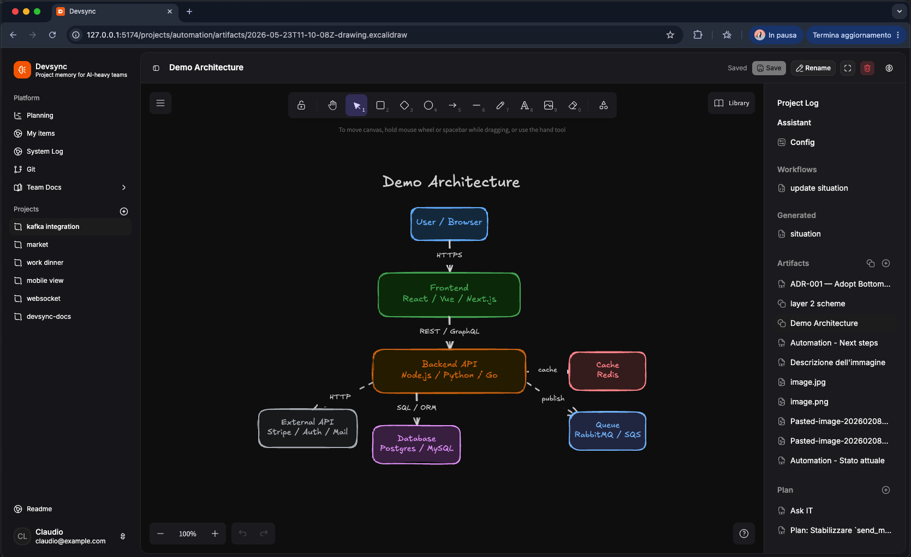
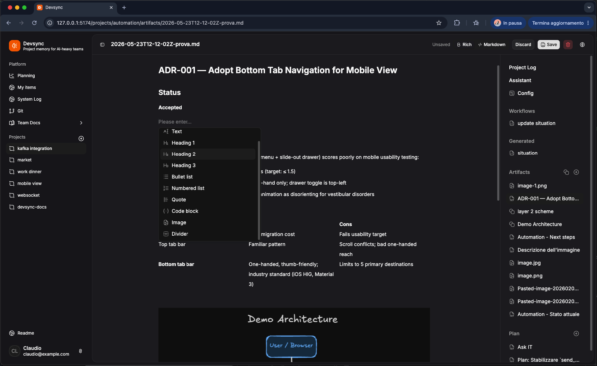

# Devsync - AI-heavy team context engine 

DevSync is a local-first, self-hosted team context engine that keeps updates, documentation, resources, activity logs, tasks, AI assistants, and automations in sync—turning scattered inputs into shared context, useful outputs, and trackable actions, all stored in a readable filesystem vault that can be inspected and versioned with Git.




## Getting Started / Try

Quick Docker trial:

```bash
docker run -p 4000:4000 \
  -v devsync-data:/data \
  -e AUTH_MODE=none \
  caporro/devsync:latest
```

Open:

```txt
http://127.0.0.1:4000
```

`AUTH_MODE=none` is only for private local use. For deployment, use password auth.

Full configuration: [docs/reference/env-vars.md](docs/reference/env-vars.md).

docker hub images: [https://hub.docker.com/r/caporro/devsync](https://hub.docker.com/r/caporro/devsync)



## Work Method

Devsync starts from a simple idea: teams should leave a trace of work where work actually happens.

Typical flow:

1. create a project;
2. write short updates in the activity log;
3. save long-form material as resources;
4. create tasks for work to be done;
5. use My Tasks to see what is assigned to you;
6. use Assistant and automations to summarize, update reports, and generate outputs;
7. use Team Docs for shared knowledge not tied to a single project, such as guidelines, statements, ADRs, and similar documents.

Practical rules:

- log = short timeline;
- resource = useful input/source material;
- tasks = operational work;
- work = produced or refined output;
- docs = team knowledge;
- vault = data source.

## Local Run

Build + start:

```bash
npm install
npm run build
npm start
```

Open:

```txt
http://127.0.0.1:4000
```

Local config:

```bash
cp .env.example .env
```

Minimum:

```env
AUTH_MODE=none
DEVSYNC_VAULT_NAME=devsync-vault
DEVSYNC_AGENT_MODEL=openai:gpt-4.1-mini
OPENAI_API_KEY=sk-...
```

### Run Developing

Backend:

```bash
npm run dev:server
```

Override vault from CLI:

```bash
npm run dev:server -- --vault another-vault
```

Frontend:

```bash
npm run dev:web
```

Use `.env` in the repository root.

## Production Deploy

For production, use only the Docker image, persistent storage, password auth, and HTTPS.

Generate a password hash:

```bash
node scripts/hash-password.mjs
```

Run:

```bash
docker run -d \
  --name devsync \
  -p 4000:4000 \
  -v devsync-data:/data \
  -e AUTH_MODE=password \
  -e 'AUTH_USERS=email@example.com|Name|scrypt$...' \
  -e AUTH_SESSION_SECRET='change-me-to-a-long-random-string-at-least-32-chars' \
  -e AUTH_COOKIE_SECURE=true \
  -e OPENAI_API_KEY='sk-...' \
  caporro/devsync:0.1.1
```

Notes:

- always mount persistent storage on `/data`;
- use `AUTH_COOKIE_SECURE=true` only behind HTTPS;
- put Devsync behind a reverse proxy if publicly exposed;
- do not use `AUTH_MODE=none` on shared servers.

Docker Compose:

```bash
docker compose up -d
```

## Configure

Main variables:

```env
PORT=4000
HOST=0.0.0.0
DEVSYNC_VAULT_NAME=devsync-vault
DEVSYNC_DATA_ROOT=/data
AUTH_MODE=password
AUTH_USERS=email@example.com|Name|scrypt$...
AUTH_SESSION_SECRET=change-me-to-a-long-random-string-at-least-32-chars
AUTH_COOKIE_SECURE=true
```

User format:

```txt
email|display name|password hash
```

Multiple users:

```env
AUTH_USERS=claudio@example.com|Claudio|scrypt$...,mario@example.com|Mario|scrypt$...
```

AI provider:

```env
DEVSYNC_AGENT_MODEL=openai:gpt-4.1-mini
OPENAI_API_KEY=sk-...
```

OpenAI-compatible:

```env
DEVSYNC_AGENT_MODEL=openai-compatible:model-name
OPENAI_API_KEY=...
OPENAI_BASE_URL=https://api.example.com/v1
```

Other supported providers:

```env
DEVSYNC_AGENT_MODEL=anthropic:claude-sonnet-4-5-20250929
ANTHROPIC_API_KEY=...

DEVSYNC_AGENT_MODEL=google-genai:gemini-2.5-flash
GOOGLE_API_KEY=...

DEVSYNC_AGENT_MODEL=mistralai:mistral-large-latest
MISTRAL_API_KEY=...

DEVSYNC_AGENT_MODEL=groq:openai/gpt-oss-120b
GROQ_API_KEY=...
```

Git vault sync:

```env
DEVSYNC_VAULT_REPO_URL=https://github.com/org/devsync-vault.git
DEVSYNC_GIT_USERNAME=oauth2
DEVSYNC_GIT_TOKEN=...
DEVSYNC_GIT_COMMIT_NAME=Devsync
DEVSYNC_GIT_COMMIT_EMAIL=devsync@example.invalid
```

Full reference: [docs/reference/env-vars.md](docs/reference/env-vars.md).

## Vault Structure

Default local path:

```txt
data/devsync-vault/
```

Default Docker paths:

```txt
/data/devsync-vault/
/data/auth/
/data/system/
/data/users/
```

Layout:

```txt
data/<vault>/
  README.md
  assistant.md
  vault-plan.json
  roles/
  automations/
  docs/
  projects/
    project-id/
      project.json
      README.md
      assistant.md
      roles/
      automations/
      resources/
      tasks/
      logs/
      work/
```

Meaning:

- project folder name is the project id/name shown in the UI;
- `project.json`: project metadata only; `name` is legacy and ignored;
- `README.md`: main notes;
- `logs/`: append-only activity log;
- `resources/`: raw material, inputs, sources, uploads, links, notes, images, PDFs, Excalidraw files;
- `tasks/`: tasks, owner, deadline, and index;
- `work/`: produced or refined material from Assistant, automations, or people;
- `assistant.md`: AI instructions;
- `roles/`: prompt specializations;
- `automations/`: automations.

The vault can be versioned with Git. Git sync helps, but it does not replace a full backup.

Detailed layout: [docs/reference/vault-layout.md](docs/reference/vault-layout.md).

## Automate

Devsync automates work through Assistant, roles, and automations.

Global Assistant:

```txt
data/<vault>/assistant.md
```

Project Assistant:

```txt
data/<vault>/projects/<project>/assistant.md
```

Instruction order:

```txt
base Devsync
+ vault assistant
+ project assistant
+ selected role
+ chat history
```

Example `assistant.md`:

```md
---
title: "Project Operator"
model: openai:gpt-4.1-mini
tools:
  - filesystem
  - save_generated_markdown
  - append_activity_log
read:
  - "**/*"
write:
  - work/**
  - tasks/**
---
Work on the project. Write long outputs to work/.
```

Automation:

```md
---
title: "Update Situation"
trigger: manual
tools:
  - filesystem
read:
  - README.md
  - resources/**
  - logs/**
write:
  - work/situation.md
---
Update work/situation.md with status, blockers, and next actions.
```

Supported triggers:

- `manual`;
- `event`;
- `schedule`.

Supported events:

- `project_log.added`;
- `artifact.added`;
- `task.added`.

Schedule uses 5-field cron:

```yaml
trigger: schedule
cron: "0 18 * * 1-5"
```

Main tools:

- `filesystem`;
- `append_activity_log`;
- `save_generated_markdown`;
- `send_email_ses`;
- `list_tasks`;
- `read_task`;
- `create_task`;
- `update_task`;
- `toggle_task`;
- `delete_task`.

## MCP

Devsync exposes MCP for external AI clients.

Endpoint:

```txt
/mcp
```

Local stdio:

```bash
npm run mcp
```

User token:

1. open the user menu;
2. create an MCP token;
3. configure the client with `Authorization: Bearer devsync_mcp_...`;
4. revoke the token when it is no longer needed.

Codex example:

```bash
export DEVSYNC_MCP_TOKEN=devsync_mcp_...
codex mcp add devsync --url http://127.0.0.1:4000/mcp --bearer-token-env-var DEVSYNC_MCP_TOKEN
```

MCP tools:

- `list_projects`;
- `get_project`;
- `search_files`;
- `read_file`;
- `list_tasks`;
- `read_task`;
- `create_task`;
- `update_task`;
- `toggle_task`;
- `delete_task`.

## Operate

Healthcheck:

```bash
curl http://127.0.0.1:4000/api/health
```

Expected response:

```json
{ "ok": true, "authMode": "password" }
```

Docker logs:

```bash
docker logs -f devsync
```

Minimum backup:

```txt
data/
```

System Log records events such as:

- project creation;
- metadata changes;
- resource creation;
- mention creation;
- automation runs;
- git pull/push;
- role changes.

Mentions use Markdown links:

```md
@[Claudio](devsync:user:claudio)
```

Mention notifications are stored as `mention.created` events in `data/system/events.ndjson`.
Unread state is per user only:

```txt
data/users/<userId>/inbox-state.json
```

Recommended upgrade flow:

1. back up the vault;
2. update the image;
3. restart;
4. check the healthcheck;
5. verify login;
6. open a project;
7. test Assistant if configured.

## Credits

Devsync uses and thanks:

- Node.js;
- Fastify;
- React;
- Vite;
- TypeScript;
- Tailwind CSS;
- shadcn/radix-ui;
- TanStack Query;
- Hugeicons;
- Excalidraw;
- Milkdown/Crepe;
- SVAR Gantt;
- LangChain;
- DeepAgents;
- Model Context Protocol SDK.

## License

MIT. See [LICENSE](LICENSE).

## Contributing

Contributions are welcome: PRs, issues, ideas, discussions, bug reports, documentation, automation examples, plugins, and integrations.

Project philosophy:

- KISS;
- YAGNI;
- filesystem-first;
- minimal out-of-the-box functionality;
- no database until it is truly needed;
- advanced features should preferably live in plugins;
- operational UI, not decorative UI.

We are also looking for sponsors and feedback from teams that use AI every day on real projects.

See [CONTRIBUTING.md](CONTRIBUTING.md).

## Security

Report vulnerabilities through [SECURITY.md](SECURITY.md).

Do not open public issues with secrets, reproducible exploits, or sensitive data.

## Responsibility

Devsync is provided "as is", without warranties. Whoever installs and uses it is responsible for configuration, security, backups, permissions, inserted data, AI outputs, and production use.

Outputs produced by Assistant, automations, or AI models must be reviewed before being used for operational, legal, financial, security, or production decisions.

## Next

Possible directions:

- Electron app;
- plugin system;
- subscription and conversation imports from tools such as Codex, Claude, and similar products;
- optional external integrations;
- marketplace/community automations;
- self-hosted deployment hardening.
